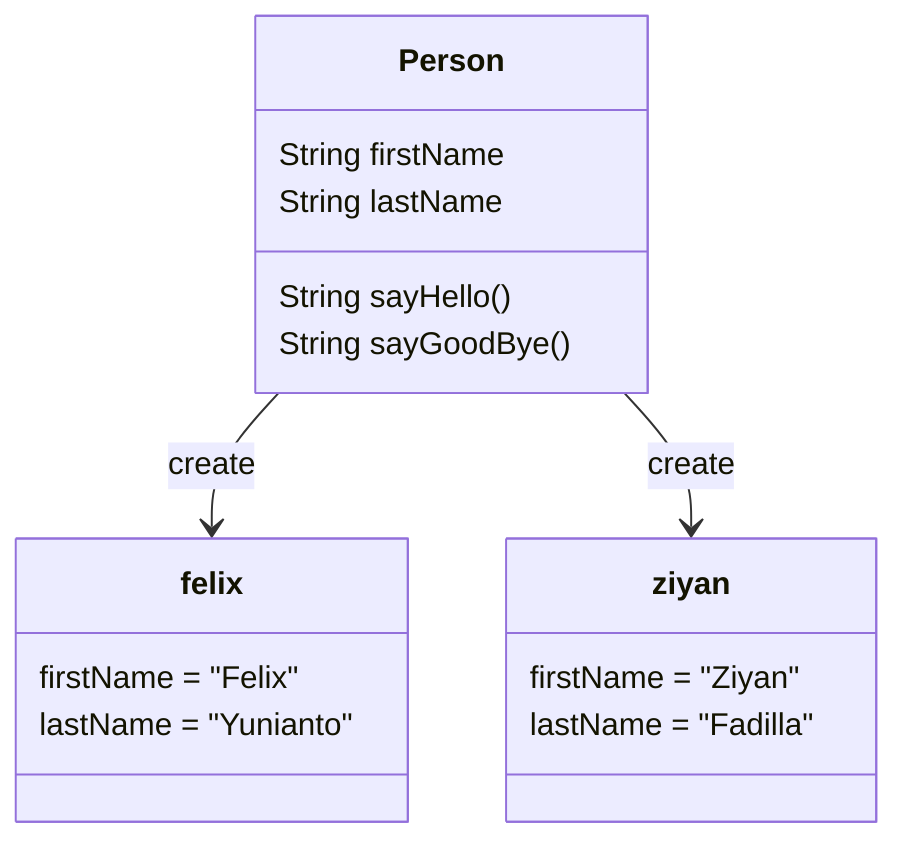

# Object Oriented Programming

> OOP adalah sudut pandang bahasa pemrograman yang berkonsep "objek".

### Object : 
> Object adalah data yang berisi field / properties / attributes dan method /function / behaviour.
> Semua data bukan primitif di Java adalah object, dari mulai Integer, Boolean, Character, String, dan yang lainnya.

### Class :
- Blueprint atau prototype untuk membuat objek.
- Class berisikan deklarasi semua properties dan functions yang dimiliki oleh Object
- Setiap Object selalu dibuat dari Class
- Dan sebuah Class bisa membuat object tanpa batas.

## Class dan Object :

### Membuat Class
- Untuk membuat class, diawali dengan kata kunci class.
- Penamaan class harus sama dengan nama filenya.

### Membuat Object
- Object adalah hasil instansiasi dari sebuah class.
- Untuk membuat object kita bisa menggunakan kata kunci new, dan diikuti dengan nam Class dan kurung ()